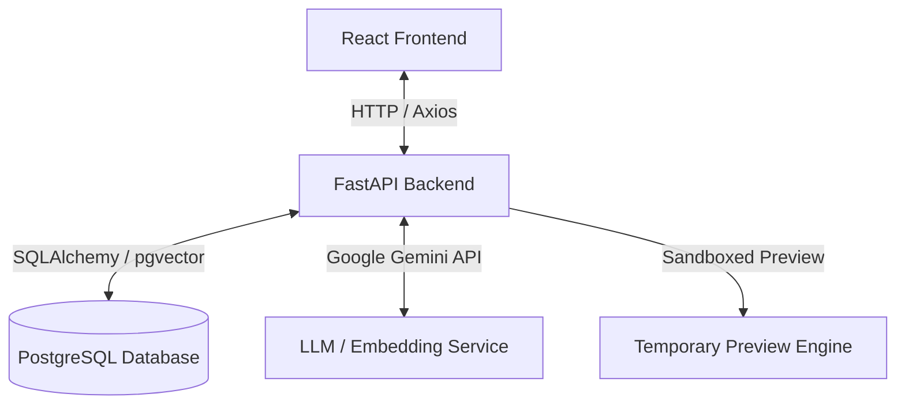

# Project Guide: Script Engine (Reuse-First Code Generator)

This guide provides a comprehensive overview of the **Script Engine** project, its architecture, technology stack, and a step-by-step learning path to help you build a similar system from scratch.

---

## 1. Project Overview

The **Script Engine** is a development utility designed to generate, reuse, and preview data conversion and ETL (Extract, Transform, Load) scripts (e.g., CSV to XLSX, JSON processing, data cleaning). 

To optimize performance and code quality, it operates on a **"Reuse-First"** principle:
1. **Semantic Search**: When you request a script, the engine first uses vector embeddings to search a database of *approved, pre-written, and optimized* scripts.
2. **Reusability Check**: If a highly similar script is found (above a similarity threshold), the engine reuses that script directly instead of generating new code.
3. **LLM Fallback**: If no suitable script is found, the engine calls the **Google Gemini API** to generate custom Python code.
4. **Execution Preview**: The backend runs the script on a small subset of the user's data to show a side-by-side (before vs. after) preview before they download it.

---

## 2. Architecture & Tech Stack



### Frontend (User Interface)
*   **React (Vite)**: A lightweight, fast-loading SPA framework for rendering the interactive dashboard.
*   **Vanilla CSS**: Used for UI components, custom theme parameters, glassmorphic styles, and interactive card transitions.
*   **Axios**: For making requests to the FastAPI endpoints.

### Backend (Logic & APIs)
*   **FastAPI**: A high-performance Python web framework for building APIs.
*   **SQLAlchemy**: Object-Relational Mapper (ORM) to interface with the database.
*   **Pydantic**: Data validation and serialization for API requests/responses.

### Database (Storage & Semantic Search)
*   **PostgreSQL**: Relational database storing user tables and script metadata.
*   **pgvector**: An open-source PostgreSQL extension that stores vector embeddings of text (descriptions/code intents) and allows fast cosine similarity searches.

### AI & Code Generation
*   **Google Gemini API (`google-generativeai`)**: Used to create embeddings for search queries and generate the Python code when fallback is triggered.

---

## 3. Core Core Workflow Explained

### A. Intent Classification & Database Search
When you request a script, the backend calculates a vector embedding of your request description using the Gemini API. It queries the PostgreSQL database using **pgvector cosine distance** to find the closest match:
```sql
SELECT repo_path, description, 1 - (embedding <=> :query_embedding) AS similarity
FROM approved_scripts
WHERE 1 - (embedding <=> :query_embedding) >= :threshold
ORDER BY similarity DESC
LIMIT 1;
```

### B. Sandbox Execution & Preview
To verify script accuracy:
1. The user uploads a sample file (CSV/XLSX).
2. The backend runs the generated Python script locally inside a sub-process wrapper (`app/services/preview_service`).
3. The original data and transformed data are converted to a simple JSON payload showing `before_data` and `after_data` in a tabular layout on the frontend.

---

## 4. Learning Path (How to Build This)

To build a project like this, we recommend mastering the components in the following order:

### Phase 1: Python Web API (FastAPI)
*   **What to learn**: Async endpoints, route separation, dependency injection (specifically database sessions), Pydantic schemas, and middleware (CORS).
*   **Resources**:
    *   [FastAPI Official Documentation](https://fastapi.tiangolo.com/) (highly interactive and easy to follow)
    *   [Uvicorn](https://www.uvicorn.org/) for running the app server.

### Phase 2: Relational Databases & ORM (PostgreSQL & SQLAlchemy)
*   **What to learn**: Declarative models, relationship mapping, transactions, and migration tools (like Alembic).
*   **Resources**:
    *   [SQLAlchemy Documentation](https://www.sqlalchemy.org/)
    *   [PostgreSQL Tutorial](https://www.postgresqltutorial.com/)

### Phase 3: Vector Databases & Embeddings (pgvector & LLMs)
*   **What to learn**: What vector embeddings are (numerical representation of semantic meaning), how distance metrics (Cosine vs. L2) work, and how to use pgvector in Python.
*   **Resources**:
    *   [pgvector GitHub Repository](https://github.com/pgvector/pgvector)
    *   [Google Gemini API Quickstart](https://ai.google.dev/gemini-api/docs/quickstart?lang=python)
    *   Learn how to generate text embeddings using `models/embedding-001`.

### Phase 4: Frontend Development (React & CSS)
*   **What to learn**: React Hooks (`useState`, `useEffect`, `useContext` for Auth state), styling layouts with Flexbox and CSS Grid, and state management.
*   **Resources**:
    *   [React Dev Documentation](https://react.dev/)
    *   [Vite Guide](https://vitejs.dev/)

---

## 5. Blueprint: Step-by-Step Implementation Guide

If you want to build a similar app from scratch, follow this roadmap:

1.  **Database & Docker Setup**:
    *   Run PostgreSQL with pgvector inside a Docker container:
        ```yaml
        image: pgvector/pgvector:pg16
        ports:
          - "5432:5432"
        ```
2.  **Backend Structure Setup**:
    *   Build standard FastAPI routes for authentication (JWT), script generation, and searching.
    *   Use SQLAlchemy to connect to the database and map the `User` and `ApprovedScript` schemas.
3.  **Semantic Search Integration**:
    *   Obtain a Gemini API key.
    *   When adding an approved script, compute its embedding and save it in the database.
    *   Search by comparing request embeddings against stored embeddings.
4.  **Generative AI Fallback**:
    *   When similarity scores are low, feed the template prompt + user input to Gemini (`gemini-1.5-flash` or `gemini-1.5-pro`).
    *   Use regular expressions or parsing libraries to extract Python code from markdown fences.
5.  **Sandboxed Previews**:
    *   Write a preview wrapper that reads input files, executes the code safely in a sub-process (using `subprocess.run`), writes the outputs, and reads the differences using `pandas`.
6.  **Create Frontend Client**:
    *   Create a clean, responsive UI.
    *   Provide an input prompt text area, a file uploader for previews, and tabs to view "Generated Code", "Usage Instructions", and "Preview Data".
